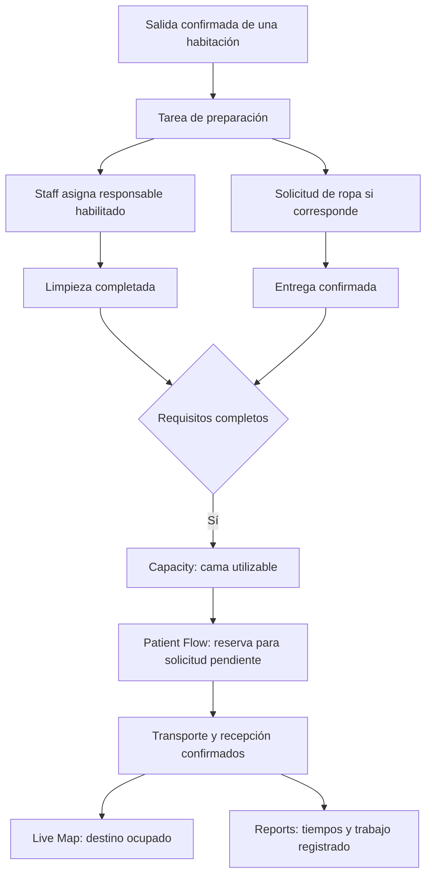

# Plan de mejoras: plataforma de logística hospitalaria

Fecha de revisión: 26 de septiembre de 2026.

## 1. Visión del producto

La idea es crear un programa que permita coordinar la logística diaria de un hospital: camas, movimientos de pacientes, personal, limpieza, transporte interno, equipos, suministros y problemas operativos.

El producto debe ayudar a responder cinco preguntas:

1. ¿Qué está pasando en el hospital?
2. ¿Qué necesita atención ahora?
3. ¿Qué está bloqueando el trabajo?
4. ¿Quién se encarga de resolverlo?
5. ¿Se resolvió y qué efecto tuvo?

Las emergencias y las llegadas masivas de pacientes son un caso especial dentro de esta operación. La experiencia principal debe funcionar durante un día normal, con ingresos, altas, cambios de turno, limpieza y reposición de material.

**Propuesta de valor:** una vista compartida del hospital que conecta cada necesidad logística con una tarea, un responsable y un resultado visible.

### Alcance de esta revisión

Este documento se basa en el código del frontend, backend y documento de arquitectura disponibles en el momento de la revisión. Incluye los cambios locales observados en Patient Flow: búsqueda, seguimiento por nombre, pausa de visualización, copia, reconocimiento local de eventos y antigüedad de la sincronización.

No es una auditoría visual realizada en navegador. Las propuestas visuales parten de la estructura de componentes y estilos. Los tamaños y distribuciones propuestos deben comprobarse posteriormente con pantallas reales.

Las funcionalidades descritas como propuestas todavía no están implementadas. Los ejemplos de tiempos, cargas y volúmenes son ilustrativos; no representan datos medidos ni reglas hospitalarias validadas.

### Usuarios principales

| Usuario | Necesidad principal | Secciones más relevantes |
| --- | --- | --- |
| Coordinación de operaciones | Detectar bloqueos y coordinar equipos | Overview, Capacity, Incidents |
| Coordinación de camas | Encontrar y preparar un destino adecuado | Capacity, Patient Flow, Live Map |
| Responsable de unidad | Conocer carga, movimientos y tareas pendientes | Overview, Staff, Patient Flow |
| Limpieza y servicios de apoyo | Recibir tareas claras y comunicar su estado | Bed turnover, Staff |
| Transporte interno | Saber a quién o qué mover, desde dónde y hacia dónde | Patient Flow, Staff |
| Mantenimiento y logística de materiales | Resolver bloqueos y reponer recursos | Incidents y futuros módulos de recursos |

### Prioridades

- **P0 — Base imprescindible:** permite cerrar un flujo completo y demostrar valor.
- **P1 — Siguiente iteración:** mejora la coordinación y cubre más situaciones.
- **P2 — Evolución:** depende de historial, integraciones o reglas más avanzadas.

P0 indica importancia para el producto, no que todas esas tareas deban caber en el hackathon. La sección 15 define un recorte concreto para la demo.

## 2. Diagnóstico general

### Lo que ya aporta valor

- Un mapa interactivo de seis plantas con habitaciones, departamentos y estados.
- Búsqueda de habitaciones, departamentos y pacientes.
- Resúmenes de capacidad por hospital, planta y departamento.
- Registro de movimientos conectado a las habitaciones del mapa.
- Backend con persistencia de habitaciones, pacientes, personal y eventos.
- Simulación de ingresos, traslados, altas, limpieza y desvíos.
- Una dirección visual reconocible: fondos claros, azul, paneles y navegación lateral.

### El salto que necesita el producto

Actualmente el sistema muestra información y simula cambios. El siguiente paso es permitir que una persona gestione trabajo real dentro del escenario: crear una solicitud, asignarla, identificar dependencias, completarla y observar el resultado.

La unidad central del producto debería ser la **tarea logística**. Un traslado, una limpieza, una entrega de ropa o una reparación comparten información: ubicación, estado, responsable, prioridad, plazos y dependencias. Cada pestaña presenta la parte del trabajo que corresponde a su usuario.

### Ajustes transversales más importantes

1. Orientar el lenguaje hacia operaciones diarias. La acción principal de Overview no debería ser siempre «Declare surge».
2. Diferenciar disponibilidad física, reserva, preparación y ocupación de una cama.
3. Mostrar datos sincronizados, datos antiguos y simulación de manera explícita.
4. Sustituir tendencias decorativas por series históricas registradas.
5. Convertir las pestañas provisionales en flujos pequeños pero completos.
6. Mantener consistencia entre las acciones y los números de todas las pantallas.

## 3. Sistema visual y navegación compartidos

### Identidad

Mantener la base azul y blanca actual. Transmite orden y permite reservar el color intenso para estados relevantes. El descriptor del producto puede evolucionar de «Surge Command» a «Hospital Operations» o «Logística hospitalaria», conservando la marca si se desea.

Cada pantalla debería tener un título, una frase que explique su función, el alcance seleccionado y una acción principal. Evitar que varias pantallas parezcan un mapa con un texto diferente en el panel derecho.

### Estructura global propuesta

```text
Hospital / sede       Buscar habitación, tarea, equipo...       Alertas / Perfil
-------------------------------------------------------------------------------
Navegación   | Título de sección                    Acción principal
             | Hospital > Planta > Unidad   Turno   Última actualización
             | Filtros activos y búsqueda local
             | Contenido principal                 Detalle contextual
```

- Orden sugerido: Overview, Live Map, Capacity, Patient Flow, Bed turnover, Staff, Incidents, Reports, Settings.
- Overview como entrada general; recordar la última sección puede ser una preferencia posterior.
- Agrupar visualmente navegación en operación, coordinación y administración, sin añadir otro nivel de menús.
- Mostrar hospital, planta y unidad de forma explícita. El selector de planta debe filtrar o navegar según una regla visible y consistente.
- Conservar filtros al abrir un detalle y volver. Mostrar «Restablecer filtros» cuando haya filtros activos.
- Las insignias de navegación deben contar trabajo pendiente relevante, no números fijos.
- Mantener búsqueda global para ubicaciones y entidades; usar búsquedas locales para las tablas de cada sección.

### Jerarquía y densidad

| Elemento | Propuesta visual inicial |
| --- | --- |
| Título de pantalla | 24–28 px, peso medio o seminegrita |
| Título de bloque | 16–18 px, frase corta |
| Texto de trabajo | 14–16 px; evitar párrafos de datos en mayúsculas |
| Texto secundario | 12–13 px para metadatos, nunca para información esencial |
| Espaciado | Escala común de 4, 8, 12, 16, 24 y 32 px |
| Paneles | Borde fino, fondo sólido, radios consistentes de aproximadamente 12–16 px |
| Tablas | Filas de 44–52 px como punto de partida; modo compacto opcional |
| Panel de detalle | Aproximadamente 340–400 px en escritorio, con alternativa de pantalla completa |
| Cifras y horas | Dígitos tabulares para evitar saltos al actualizar |

Reducir sombras, transparencias y animaciones donde compitan con datos. Un cambio operativo debe destacar más que el movimiento decorativo de un icono.

### Semántica de color

| Significado operativo | Tratamiento propuesto |
| --- | --- |
| Disponible / completado | Verde con etiqueta e icono |
| En curso / seleccionado | Azul |
| Pendiente / riesgo de retraso | Ámbar |
| Bloqueado / requiere atención urgente | Rojo |
| Limpieza / preparación | Violeta |
| Fuera de servicio / sin información | Gris con etiquetas diferentes |

Separar el estado de una cama de la gravedad de su paciente. Una habitación ocupada puede contener a un paciente crítico, pero «ocupada» y «crítico» son dos datos distintos. La capa activa del mapa debe indicar qué representa el color.

Las propuestas de marcadores por rol del documento de simulación pueden mantenerse en una capa de personas, con su propia leyenda. No mezclar esos colores con la leyenda de camas sin explicar la diferencia.

### Interacciones, accesibilidad y estados

- No depender solo del color: incluir texto, iconos o patrones.
- Mantener foco visible, controles etiquetados y alternativas a arrastrar tarjetas.
- Respetar reducción de movimiento y evitar destellos persistentes.
- No reordenar automáticamente la fila que una persona está leyendo o editando.
- Mostrar «Sin tareas pendientes» de forma diferente a «No se pudieron cargar las tareas».
- Si hay un fallo de conexión, conservar los últimos datos con su antigüedad visible.
- No presentar datos de ejemplo como información conectada al backend.
- Sonidos desactivables; reservarlos para avisos seleccionados, evitando reproducirlos en cada visita a una habitación.
- Adaptar escritorio a tablas y mapa; tablet a paneles apilados; móvil a listas de tareas con acciones grandes.

## 4. Live Map — mapa operativo

### Objetivo

Entender dónde está cada recurso y qué sucede en una ubicación. Desde el mapa debería poder abrirse una tarea o iniciarse una solicitud relacionada con esa habitación.

### Estado actual

Hay plantas, habitaciones seleccionables, búsqueda, zoom, desplazamiento, ascensor y ficha lateral. La ficha contiene Overview, Patients e History. La información se concentra en camas y pacientes; el plano todavía no representa una operación logística completa.

### Mejoras funcionales

| Prioridad | Mejora | Comportamiento esperado |
| --- | --- | --- |
| P0 | Filtros operativos | Ver camas disponibles, pendientes de limpieza, reservadas y fuera de servicio. Mostrar filtros activos y botón para limpiarlos. |
| P0 | Resumen de ubicación | Mostrar estado, responsable, tareas pendientes y bloqueo principal al seleccionar una habitación. |
| P0 | Acciones contextuales | Crear solicitud de limpieza, transporte o incidencia desde la ubicación; reutilizar el mismo flujo de la sección correspondiente. |
| P0 | Estado del dato | Mostrar cuándo se actualizó el mapa y si se trata de una simulación. |
| P1 | Capas independientes | Alternar camas, personas, equipos y tareas sin dibujarlo todo simultáneamente. |
| P1 | Localizar una tarea | Abrir la planta correcta y resaltar origen y destino desde otra pestaña. |
| P1 | Recorridos | Representar el recorrido de un transporte si existe una red de pasillos y conexiones; no atravesar paredes con líneas decorativas. |
| P2 | Personas en movimiento | Animar movimientos asociados a tareas y ubicaciones conocidas, conforme al motor de simulación. |

### Mejoras visuales

- Dar al mapa el área principal; convertir el resumen izquierdo en un panel plegable para reducir la superposición actual.
- Colocar una barra compacta sobre el plano: planta, unidad, capa activa, filtros y «Ajustar vista».
- Mostrar una leyenda para estados de cama además de los símbolos de ascensor, escaleras y baños.
- Diferenciar selección mediante contorno y etiqueta, sin reemplazar el color del estado.
- Aplicar detalle progresivo: a zoom lejano, departamentos; a zoom medio, habitaciones; a zoom cercano, identificadores y tareas.
- Mostrar equipos y personas agrupados cuando haya muchos elementos próximos.
- Reservar la parte superior del panel derecho para la información útil: «MED-204 · pendiente de limpieza · tarea asignada». La imagen de interior debe ser secundaria o plegable.
- Añadir indicadores de tareas por ubicación, por ejemplo «2 pendientes», sin llenar cada habitación de insignias.

### Subpestañas de habitación

| Subpestaña | Mejora funcional | Mejora visual |
| --- | --- | --- |
| Overview | Estado de cama, preparación, equipamiento, responsable y tareas vinculadas | Resumen breve arriba, bloque «Pendiente» en el centro y una acción principal abajo |
| Patients | Identificador de episodio, ubicación, destino solicitado y bloqueo del traslado | Mostrar primero contexto logístico; plegar datos clínicos secundarios |
| History | Alternar historial de habitación y del paciente; distinguir eventos registrados de ejemplos | Línea temporal con autor, hora, estado anterior y estado nuevo |

### Criterio de aceptación

Desde una habitación pendiente de limpieza se puede abrir su tarea, completarla desde Bed turnover y observar el nuevo estado en el mapa y Capacity, sin modificar datos por separado en cada pantalla.

## 5. Overview — resumen de la operación

### Objetivo

Permitir que coordinación entienda el estado del hospital y decida dónde intervenir primero.

### Estado actual

Incluye indicadores de camas, ocupación por planta, departamentos, mezcla de movimientos y subpestañas de flujo, personal y alertas. Parte de la información se repite en otras secciones. Las pequeñas curvas y variaciones de los indicadores se generan mediante fórmulas, no mediante un historial de mediciones.

### Mejoras funcionales

| Prioridad | Mejora | Comportamiento esperado |
| --- | --- | --- |
| P0 | Cola de atención | Mostrar los bloqueos más relevantes con motivo, antigüedad, responsable y acceso a la acción. |
| P0 | Indicadores operativos | Camas utilizables, traslados pendientes, tareas de limpieza y tareas sin asignar. |
| P0 | Alcance y período | Indicar si los datos corresponden al hospital, una planta o una unidad, y a qué turno o intervalo. |
| P0 | Enlaces consistentes | Pulsar «Limpiezas pendientes» abre Bed turnover con el filtro equivalente. |
| P1 | Historial auténtico | Registrar muestras de indicadores y comparar períodos equivalentes. Mostrar «Sin historial suficiente» cuando corresponda. |
| P1 | Resumen de turno | Pendientes heredados, trabajo completado y problemas abiertos para el relevo. |
| P2 | Anticipación de demanda | Estimaciones basadas en historial o escenarios explícitos, con supuestos visibles. |

### Mejoras visuales

```text
Resumen de operaciones                 Hospital completo | Turno actual
------------------------------------------------------------------------
Camas utilizables | Traslados pendientes | Limpiezas pendientes | Sin asignar
------------------------------------------------------------------------
Necesita atención                    | Estado por planta
Bloqueo / espera / responsable        | Camas y tareas pendientes
Acción recomendada                   | Abrir unidad
------------------------------------------------------------------------
Carga durante el turno               | Actividad reciente
```

- Limitar la primera fila a cuatro indicadores útiles; cada uno debe poder abrir su detalle.
- Usar etiquetas completas y períodos visibles: «Traslados pendientes ahora» o «Limpiezas completadas en este turno».
- Reservar rojo para situaciones que requieren acción, no para todos los pacientes de determinada categoría.
- Cambiar gráficos redundantes por una tabla compacta de plantas y bloqueos.
- Mantener emergencias como aviso destacado cuando haya una activa; ofrecer «Crear solicitud» o «Ver pendientes» como acción cotidiana.
- Mostrar explicación al pasar o enfocar un indicador: definición, período y última actualización.

### Subpestañas actuales

- **Overview:** conservar como resumen principal.
- **Patient flow:** mostrar un extracto y «Abrir flujo de pacientes», preservando filtros.
- **Staffing:** mostrar disponibilidad y sobrecarga; abrir Staff para asignar trabajo.
- **Alerts:** resumir incidencias abiertas y llevar a Incidents para gestionarlas.

### Criterio de aceptación

Cada cifra que representa trabajo pendiente abre exactamente los elementos que la componen. Una tarea completada deja de contarse como pendiente en todas las vistas.

## 6. Capacity — capacidad utilizable

### Objetivo

Mostrar qué capacidad puede utilizarse ahora, qué capacidad está bloqueada y qué trabajo permitiría recuperarla.

### Estado actual

Presenta camas disponibles, ocupadas, críticas y en limpieza, con desgloses por planta y departamento. La disponibilidad todavía se basa principalmente en el estado de la habitación. Los umbrales de ocupación generan etiquetas como «Watch» y «Divert».

### Mejoras funcionales

| Prioridad | Mejora | Comportamiento esperado |
| --- | --- | --- |
| P0 | Estados separados | Distinguir disponible, reservada, ocupada, pendiente de preparación y fuera de servicio. |
| P0 | Causa de indisponibilidad | Mostrar limpieza, falta de personal habilitado, equipo pendiente o mantenimiento. Una cama puede tener varias causas. |
| P0 | Reserva consistente | Reservar una cama de forma que dos solicitudes no puedan obtenerla simultáneamente. |
| P0 | Capacidad utilizable | Calcular disponibilidad con requisitos configurados, sin contar automáticamente todas las habitaciones vacías. |
| P1 | Recuperación prevista | Mostrar camas pendientes de tareas y estimación de disponibilidad cuando exista información suficiente. |
| P1 | Equipos limitantes | Añadir disponibilidad de equipos necesarios por unidad y enlace a su ubicación. |
| P1 | Apertura de espacios | Activar espacios adicionales solo cuando se cumplan sus requisitos; registrar responsable y motivo. |
| P2 | Escenarios | Comparar qué cambia al liberar habitaciones o añadir cobertura cualificada. |

No convertir un porcentaje de ocupación en una orden automática de desvío. Presentarlo como señal de presión configurable; una decisión operativa debe tener contexto y quedar registrada.

### Mejoras visuales

- Encabezar con «Disponibles para asignar» y explicar qué requisitos incluye ese número.
- Añadir contadores separados de reservadas, pendientes de preparación y fuera de servicio.
- En la tabla por unidad, incluir «Bloqueo principal» y «Abrir pendientes».
- Usar barras apiladas con estados mutuamente excluyentes y leyenda completa. Las causas múltiples se muestran en el detalle, sin duplicar camas en el total.
- Mantener encabezados fijos y permitir ordenar por disponibilidad o número de camas bloqueadas.
- Al abrir una unidad, mostrar camas concretas y la tarea que impide usar cada una.
- Mostrar estimaciones como intervalos o «Sin estimación»; evitar cuentas atrás inventadas.

### Criterio de aceptación

Una cama limpia pero fuera de servicio no aparece como utilizable. Una reserva reduce la disponibilidad libre sin incrementar la ocupación; el ingreso confirmado es el que la convierte en ocupada.

## 7. Patient Flow — solicitudes y movimientos

### Objetivo

Coordinar el movimiento de pacientes entre ubicaciones y explicar por qué una solicitud todavía no se ha completado.

### Estado actual

Existe un registro de eventos con filtros, búsqueda, seguimiento por nombre, pausa de visualización, copia, navegación por teclado y acceso al mapa. El reconocimiento de eventos se guarda localmente en el componente. La API devuelve una ventana de los últimos 40 eventos; esa ventana no constituye el historial completo de un paciente.

### Mejoras funcionales

| Prioridad | Mejora | Comportamiento esperado |
| --- | --- | --- |
| P0 | Solicitudes pendientes | Crear y listar solicitudes con paciente, origen, destino solicitado, prioridad y hora de creación. |
| P0 | Dependencias | Separar espera de aceptación, cama, preparación y transporte. Mostrar qué impide el siguiente paso. |
| P0 | Responsable | Asignar transporte y mostrar quién acepta la recepción. |
| P0 | Identidad estable | Vincular eventos a identificadores de paciente y episodio, en lugar de agrupar únicamente por nombre. |
| P0 | Confirmación de llegada | Completar el traslado al confirmar recepción; actualizar origen, destino y tareas derivadas. |
| P1 | Historial paginado | Consultar movimientos anteriores sin depender de las últimas 40 líneas. |
| P1 | Escalado | Avisar de solicitudes con retraso según reglas configuradas y registrar a quién se avisa. |
| P1 | Reconocimiento compartido | Guardar quién revisó un aviso y cuándo; distinguir «visto» de «resuelto». |
| P2 | Coordinación de trayectos | Agrupar trabajo compatible considerando restricciones, ubicaciones y disponibilidad. |

### Mejoras visuales

- Ofrecer dos vistas: **Pendientes** y **Actividad**. Mantener el registro actual como actividad detallada.
- En Pendientes, usar columnas: paciente/episodio, origen, destino, estado, espera, responsable y acción.
- Mostrar «F1 · ED-03 → F2 · MED-204» con etiquetas visibles, además de enlaces al mapa.
- Separar prioridad de retraso. Una solicitud importante puede ser reciente; una antigua puede estar bloqueada por otra causa.
- Dar al detalle una secuencia de hitos: solicitada, aceptada, destino preparado, transporte asignado, salida y llegada.
- Conservar atajos como opción avanzada, junto a controles visibles de buscar, pausar y reanudar.
- Usar lenguaje de operación en la vista principal: «Buscar movimientos» y «Última sincronización», dejando la estética de terminal como alternativa si se desea.
- Mostrar «Visualización pausada; el sistema sigue actualizándose». La pausa actual del registro no detiene el hospital ni el simulador.
- Reemplazar inferencias demasiado específicas, como deducir una emergencia de varios eventos, por avisos descriptivos hasta disponer de reglas validadas: «Aumento de eventos que requieren revisión».

### Criterio de aceptación

Una solicitud pendiente de cama muestra su bloqueo, puede reservar un destino cuando esté disponible y deja un historial completo tras la confirmación de llegada. El origen genera una tarea de preparación cuando corresponda.

## 8. Bed turnover — preparación de habitaciones

### Objetivo

Gestionar el trabajo necesario para que una habitación vuelva a estar utilizable después de una salida. Puede incluir limpieza, ropa, reposición y comprobaciones definidas por el hospital.

### Estado actual

La navegación abre un texto explicativo sobre las camas en limpieza. No hay un tablero de tareas ni acciones de asignación y finalización. El simulador intenta limpiar una habitación solo cuando no encuentra otras acciones posibles; ese comportamiento puede relegar la limpieza.

### Mejoras funcionales

| Prioridad | Mejora | Comportamiento esperado |
| --- | --- | --- |
| P0 | Creación automática | Una salida que requiere preparación crea una tarea una sola vez. |
| P0 | Ciclo de tarea | Pendiente → asignada → en curso → completada, con bloqueos y cancelación como estados explícitos. |
| P0 | Asignación | Seleccionar trabajador o equipo disponible y habilitado para ese tipo de tarea. |
| P0 | Dependencias visibles | Indicar ropa, material, equipo o mantenimiento pendiente. |
| P0 | Cierre coherente | Completar limpieza no libera la cama si quedan otros requisitos sin cumplir. |
| P1 | Lista de comprobación | Pasos configurables por tipo de espacio; verificación adicional cuando el proceso definido la requiera. |
| P1 | Priorización | Ordenar considerando antigüedad, solicitudes vinculadas y prioridad operativa. |
| P1 | Tiempos registrados | Medir espera, ejecución y duración total por separado. |
| P2 | Coordinación de recorridos | Proponer secuencias de tareas próximas y compatibles. |

### Mejoras visuales

```text
Preparación de habitaciones                         Nueva tarea
Pendientes | En curso | Bloqueadas | Completadas en el turno
----------------------------------------------------------------
Por asignar      Asignadas        En curso         Completadas
MED-204          ICU-302          ED-03            MED-210
Espera: 12 min   Equipo B         Inicio: 10:35    Fin: 10:40
Falta ropa      Lista para iniciar                 Ver historial
```

- Ofrecer tablero y tabla, compartiendo filtros y estados.
- Tarjetas con habitación como título, planta, antigüedad, responsable y dependencia principal.
- Violeta para preparación; rojo solo para bloqueos que requieren intervención.
- Acción visible por estado: «Asignar», «Iniciar», «Registrar bloqueo» o «Completar».
- Si se permite arrastrar, validar la transición y ofrecer la misma acción mediante botón.
- En móvil, priorizar «Mis tareas» y un detalle con controles grandes.
- Mostrar tareas completadas del período seleccionado; evitar que el tablero crezca indefinidamente.

### Criterio de aceptación

Completar una tarea registra responsable y tiempos, actualiza la habitación y elimina el pendiente. Si falta ropa u otro requisito, la habitación continúa bloqueada con la causa visible.

## 9. Staff — personal y asignación de trabajo

### Objetivo

Conocer quién está de turno, qué trabajo tiene, qué puede realizar y dónde hace falta cobertura.

### Estado actual

Se muestra una lista con nombre, especialidad, unidad, extensión y turno. Overview obtiene además personal asociado a camas ocupadas. Esas dos fuentes no equivalen necesariamente a un único modelo de disponibilidad y carga.

### Mejoras funcionales

| Prioridad | Mejora | Comportamiento esperado |
| --- | --- | --- |
| P0 | Roster unificado | Una fuente común para turnos, roles, unidad y estado de disponibilidad. |
| P0 | Trabajo asignado | Mostrar tareas activas y pendientes por persona o equipo. |
| P0 | Habilitaciones | Filtrar candidatos por capacidad para realizar la tarea; explicar por qué alguien no es elegible. |
| P0 | Asignar y reasignar | Registrar quién cambia una asignación y mantener la tarea visible durante el cambio. |
| P1 | Pausas y relevo | Reflejar descansos, final de turno y tareas que necesitan transferencia de responsabilidad. |
| P1 | Cobertura | Comparar demanda y capacidad con reglas configuradas por servicio. |
| P1 | Mi trabajo | Vista personal para aceptar, iniciar y completar tareas. |
| P2 | Propuestas de distribución | Sugerir reparto considerando duración, ubicación, habilitaciones y carga. |

No interpretar el número de tareas como carga equivalente: transportar a un paciente, entregar material y limpiar una habitación pueden tener esfuerzos distintos. Empezar mostrando tipo, cantidad y antigüedad antes de inventar una puntuación única.

### Mejoras visuales

- Convertir Staff en pantalla propia, con filtros por unidad, rol, turno y disponibilidad.
- Usar tabla: persona/equipo, rol, unidad, estado, tarea activa, pendientes y fin de turno.
- Panel lateral con habilitaciones, tareas y controles de asignación.
- Mostrar cobertura por unidad mediante barras sencillas, con definición visible del cálculo.
- Diferenciar «En pausa», «Ocupado», «Disponible» y «Fuera de turno» con etiquetas completas.
- Reservar fotografías para cuando aporten identificación útil; iniciales son suficientes en el prototipo.
- Mostrar disponibilidad desconocida como tal, sin convertirla en «Disponible».

### Criterio de aceptación

Una tarea solo se asigna a personal elegible según la configuración. La asignación se refleja en Staff, en la sección de la tarea y en el historial compartido.

## 10. Incidents — incidencias operativas

### Objetivo

Gestionar problemas que afectan al funcionamiento del hospital: un ascensor averiado, una habitación fuera de servicio, falta de material o una llegada extraordinaria de pacientes.

### Estado actual

Se presenta un accidente ferroviario fijo con activación de surge. La activación crea pacientes críticos en camas disponibles seleccionadas; algunos textos lo describen como reserva, aunque el efecto real es ocupación.

### Mejoras funcionales

| Prioridad | Mejora | Comportamiento esperado |
| --- | --- | --- |
| P0 | Incidencias generales | Crear incidencias con tipo, ubicación, descripción, prioridad y responsable. |
| P0 | Ciclo de resolución | Nueva → reconocida → en curso → resuelta → cerrada, con registro de cambios. |
| P0 | Impacto vinculado | Relacionar habitaciones, equipos y tareas afectadas; el bloqueo debe verse en las otras pestañas. |
| P0 | Acciones y responsables | Crear tareas de respuesta y mostrar qué queda por resolver. |
| P1 | Emergencias como categoría | Añadir llegadas previstas y plan de respuesta dentro del mismo sistema de coordinación. |
| P1 | Seguimiento | Registrar comentarios, escalados y actualizaciones sin perder la cronología. |
| P1 | Agrupación | Evitar avisos duplicados del mismo problema y vincular sus efectos. |
| P2 | Reglas de detección | Generar propuestas de incidencia basadas en señales operativas; permitir revisión y descartar falsos positivos. |

### Mejoras visuales

- Lista principal con prioridad, título, ubicación, alcance, responsable y antigüedad.
- Filtros: abiertas, sin asignar, por unidad, por categoría y cerradas.
- Panel de detalle con resumen de impacto, tareas de respuesta y línea temporal.
- En emergencias, usar una franja persistente con alcance y estado; evitar teñir toda la aplicación de rojo.
- Campana global alimentada por avisos reales del sistema, con acceso al objeto correspondiente.
- Diferenciar «Visto», «Responsable asignado» y «Resuelto» visualmente y en los datos.

### Criterio de aceptación

Una avería vinculada a una habitación impide contar esa cama como utilizable. Resolver la avería elimina ese bloqueo concreto; no borra otras tareas pendientes de preparación.

## 11. Reports — resultados y análisis

### Objetivo

Entender dónde se pierde tiempo y comprobar el efecto de los cambios operativos mediante datos registrados.

### Estado actual

Es una pestaña provisional que indica que los informes están fuera de la demo. Todavía no hay una pantalla de análisis ni un conjunto de métricas históricas completas.

### Mejoras funcionales

| Prioridad | Mejora | Comportamiento esperado |
| --- | --- | --- |
| P0 | Resumen de turno | Trabajo creado, completado y pendiente al cierre, separado por tipo y unidad. |
| P0 | Definiciones | Mostrar período, fuente y fórmula de cada indicador. |
| P1 | Duraciones | Separar tiempo de espera, tiempo de ejecución y tiempo total. |
| P1 | Causas de bloqueo | Agrupar retrasos por limpieza, transporte, aceptación, equipo o mantenimiento. |
| P1 | Exportación | Descargar el informe con filtros, fecha de generación y datos mínimos necesarios. |
| P1 | Relevo | Generar una lista de pendientes y responsables para el siguiente turno. |
| P2 | Comparaciones | Comparar períodos equivalentes o escenarios reproducibles; explicar diferencias de demanda. |

### Métricas iniciales sugeridas

| Métrica | Definición propuesta |
| --- | --- |
| Espera para asignación | Momento de asignación menos momento de creación de la tarea |
| Ejecución de limpieza | Momento de finalización menos momento de inicio |
| Preparación total | Momento en que la habitación cumple requisitos menos momento en que quedó pendiente de preparación |
| Traslado total | Confirmación de llegada menos creación de la solicitud |
| Trabajo pendiente al cierre | Tareas no finalizadas al final del período, incluyendo las heredadas |
| Bloqueo por causa | Intervalos registrados para una causa; indicar cómo se trata el solapamiento |

Mostrar tamaño de muestra y tareas todavía abiertas. No calcular tiempos de finalización inexistentes como cero. Para percentiles o comparaciones, indicar cuando la muestra es insuficiente.

### Mejoras visuales

- Barra superior con período, turno, unidad y exportación.
- Tres o cuatro indicadores, seguidos por evolución temporal y principales causas de demora.
- Barras horizontales para comparar unidades y líneas para evolución; evitar gráficos que no permiten leer valores.
- Tabla de detalle al final para rastrear cada resultado hasta sus tareas.
- Mostrar «Datos insuficientes» en lugar de una curva ilustrativa.
- Incluir un resumen textual: «La mayor parte del tiempo de preparación registrado corresponde a espera de asignación», solo cuando los datos lo sostengan.

### Criterio de aceptación

Cada cifra puede explicarse a partir del historial. Dos personas con los mismos filtros obtienen el mismo resultado y pueden ver qué tareas se incluyeron.

## 12. Settings — configuración y preferencias

### Objetivo

Configurar el hospital y adaptar la experiencia a cada usuario, distinguiendo preferencias personales de cambios operativos compartidos.

### Estado actual

Es una pestaña provisional. Hay integración de inicio de sesión, pero eso no equivale por sí solo a permisos operativos aplicados en el backend.

### Mejoras funcionales

| Prioridad | Mejora | Comportamiento esperado |
| --- | --- | --- |
| P0 | Preferencias personales | Idioma, sonido, densidad, sección inicial y alcance habitual. |
| P0 | Configuración de demo | Pausar motor, cambiar velocidad y reiniciar únicamente el escenario de simulación. |
| P0 | Estado de conexión | Mostrar sincronización y errores por servicio de forma comprensible. |
| P1 | Hospital y unidades | Configurar nombres, ubicaciones, tipos de espacio y requisitos operativos. |
| P1 | Roles y permisos | Diferenciar consultar, asignar, cerrar tareas y administrar; verificar permisos en las operaciones del servidor. |
| P1 | Reglas de aviso | Configurar plazos y escalado por tipo de tarea, indicando a quién afectan. |
| P1 | Trazabilidad | Registrar cambios de configuración, autor y fecha de aplicación. |
| P2 | Integraciones | Configurar fuentes externas con estado, última recepción y errores, sin exponer credenciales. |

### Mejoras visuales

- Navegación interna: Mi experiencia, Hospital, Equipos y roles, Notificaciones, Conexiones y Simulación.
- Formularios cortos con ayuda al lado del campo que la necesita.
- Mostrar cuándo una preferencia se guarda automáticamente y cuándo requiere «Guardar cambios».
- Mantener cambios operativos pendientes visibles hasta confirmación del servidor.
- Separar reinicio de simulación de las preferencias cotidianas y explicar su efecto.
- Ofrecer vista previa para densidad y notificaciones.
- No mostrar interruptores que parezcan funcionales si todavía no tienen comportamiento.

### Criterio de aceptación

Cambiar el sonido solo afecta al usuario. Cambiar una regla compartida requiere el permiso correspondiente y registra el cambio. Reiniciar una demo no afecta datos operativos de otro entorno.

## 13. Cobertura logística que falta en las pestañas actuales

Para evolucionar hacia la logística de todo el hospital, habrá que cubrir recursos además de camas. Conviene introducirlos como tipos de tarea y entidades compartidas antes de multiplicar las pestañas.

| Área | Dónde encaja inicialmente | Funcionalidad mínima | Vista especializada futura |
| --- | --- | --- | --- |
| Transporte de pacientes | Patient Flow + Staff | Solicitud, origen, destino, responsable y recepción | Cola de transportes y recorridos |
| Transporte de materiales | Tareas compartidas + Staff | Recogida, entrega y confirmación | Despacho de logística |
| Ropa y lavandería | Bed turnover + tareas de suministro | Solicitar ropa y confirmar entrega | Demanda por unidad y reposición |
| Equipos móviles | Capacity + Live Map | Ubicación, estado, reserva y asignación | Inventario de equipos |
| Almacén y consumibles | Tareas de suministro | Solicitud, preparación, entrega y faltantes | Stock y reposición |
| Mantenimiento | Incidents | Avería, recurso afectado y reparación | Órdenes de trabajo |
| Esterilización | Tareas de apoyo vinculadas | Solicitud de material, preparación y disponibilidad | Flujo de lotes y trazabilidad específica |

Una pestaña futura **Resources / Recursos** tendría sentido cuando equipos y suministros dispongan de suficiente funcionalidad propia. No mezclar stock de consumibles con disponibilidad de equipos reutilizables: requieren estados y movimientos diferentes.

El documento `SIMULATION_ARCHITECTURE.md` ya plantea dependencias entre plantas, ropa, personal y tareas. Este plan utiliza esa dirección, pero no da por aprobados sus horarios, dotaciones o reglas todavía abiertos.

## 14. Modelo compartido y conexiones entre pestañas

### Datos necesarios

- **Ubicación:** hospital, planta, unidad, habitación y conexiones relevantes.
- **Paciente y episodio:** identificadores estables para vincular solicitudes e historial.
- **Cama:** ocupación, reservas y bloqueos operativos como conceptos separados.
- **Tarea:** tipo, estado, prioridad, ubicación, responsable, fechas y dependencias.
- **Personal/equipo:** rol, habilitaciones, turno, disponibilidad y asignaciones.
- **Recurso:** tipo, ubicación, estado y reservas si corresponde.
- **Incidencia:** problema, impacto, responsable, tareas asociadas y resolución.
- **Evento:** cambio ocurrido, entidad, autor, hora y relación con el proceso que lo originó.

### Reglas de coherencia

1. Una acción tiene un resultado compartido: todas las pestañas consultan el mismo estado persistido.
2. Reintentar una solicitud no duplica la tarea ni la reserva.
3. Asignaciones y reservas comprueban conflictos en el servidor, incluso si dos usuarios actúan a la vez.
4. Cada transición registra su hora y responsable; el historial no depende de textos inventados cuando faltan eventos.
5. La interfaz informa de acciones pendientes, éxito y fallo; no muestra un cierre definitivo antes de confirmarlo.
6. Las solicitudes bloqueadas permanecen en cola con causa explícita.
7. No se deduce disponibilidad de personal solo porque no aparezca en una cama ocupada.
8. Los tiempos de simulación y de reloj real se distinguen al acelerar o pausar el motor.

### Ejemplo de conexión completa



Los ejemplos operativos deben apoyarse en autorizaciones y reglas previamente configuradas. El sistema coordina tareas y recursos; no necesita generar decisiones clínicas para demostrar su valor logístico.

## 15. Orden de implementación y demo de hackathon

### Primera entrega: una historia cotidiana completa

**Escenario:** hay un paciente con traslado autorizado esperando destino. Existe una habitación vacía que todavía requiere preparación. Coordinación asigna la tarea, el equipo la completa, se reserva la cama y se confirma el traslado.

Implementación mínima:

1. Modelo de tarea persistida y eventos de cambio.
2. Creación de tarea de preparación ligada a una salida o escenario inicial.
3. Bed turnover con asignar, iniciar y completar.
4. Staff con disponibilidad básica y tareas asignadas.
5. Capacity con disponible, reservada, ocupada y pendiente de preparación.
6. Patient Flow con una solicitud pendiente, bloqueo, reserva y confirmación de llegada.
7. Live Map y Overview actualizados desde el mismo estado.
8. Resumen de tiempos registrados y reinicio reproducible de la demo.

Para esta entrega, usar un tipo de preparación y un tipo de transporte con reglas explícitas. Extender a dependencias de ropa y mantenimiento después de que el recorrido básico funcione.

### Segunda entrega: operación diaria más completa

- Incidencias de mantenimiento que bloqueen recursos.
- Dependencias de ropa y material en preparación.
- Turnos, pausas y relevo de tareas.
- Historial paginado y reconocimiento compartido de avisos.
- Indicadores históricos y reportes por período.
- Vistas adaptadas para el personal que ejecuta tareas desde tablet o móvil.

### Tercera entrega: escala y anticipación

- Equipos y suministros con inventario propio.
- Integraciones con fuentes externas.
- Simulación de demanda y escenarios comparables.
- Estimaciones y propuestas de asignación explicables.
- Coordinación entre sedes cuando el modelo de un hospital esté consolidado.

### Mejoras visuales de mayor retorno inmediato

1. Unificar encabezados, filtros, tablas, estados y paneles de detalle.
2. Añadir leyenda operativa y filtros al mapa.
3. Dar pantalla propia a Bed turnover y Staff.
4. Simplificar Overview y llevar las acciones a sus módulos correspondientes.
5. Dar a Patient Flow una vista de pendientes además del registro.
6. Reducir superposición de paneles y aumentar legibilidad de datos esenciales.
7. Mostrar sincronización, simulación y errores de forma consistente.

### Demo sugerida

| Paso | Pantalla | Qué debe quedar claro |
| --- | --- | --- |
| 1 | Overview | Hay trabajo pendiente y se conoce el bloqueo |
| 2 | Capacity / Live Map | La habitación existe, pero requiere preparación |
| 3 | Bed turnover / Staff | Hay una tarea concreta y una persona responsable |
| 4 | Bed turnover | La tarea se completa y queda registrada |
| 5 | Patient Flow | Se reserva el destino y se confirma el traslado |
| 6 | Overview / Reports | El pendiente desaparece y aparecen tiempos medidos |

Una segunda demostración puede introducir una avería o un aumento de llegadas. El funcionamiento diario debe entenderse antes de presentar ese caso excepcional.

## 16. Comprobaciones antes de presentar

- [ ] Los nombres y mensajes explican logística hospitalaria diaria, además de emergencias.
- [ ] Las pestañas disponibles tienen una función reconocible; las futuras se identifican como tales.
- [ ] Una tarea puede recorrerse de principio a fin y conserva su historial.
- [ ] Mapa, capacidad, pendientes y reportes muestran datos coherentes.
- [ ] Reservar una cama no equivale a ingresar un paciente.
- [ ] Completar limpieza no elimina otros bloqueos de la habitación.
- [ ] La pérdida de conexión no se presenta como ausencia de trabajo.
- [ ] Pausar el registro y pausar el simulador tienen controles y mensajes diferentes.
- [ ] Los números de resultados proceden de eventos registrados y muestran su período.
- [ ] La demo se puede reiniciar sin depender de resultados aleatorios difíciles de reproducir.
- [ ] La navegación funciona con teclado y los estados se entienden sin depender del color.
- [ ] La landing describe lo implementado y separa claramente la visión futura.

## 17. Referencias del código revisado

| Archivo | Relación con este plan |
| --- | --- |
| `frontend/src/dashboard/CommandCenter.jsx` | Navegación, sincronización, ficha de habitación, personal e incidentes |
| `frontend/src/dashboard/FloorPlan.jsx` | Representación e interacción del plano |
| `frontend/src/dashboard/Overview.jsx` | Indicadores, resúmenes y tendencias actuales |
| `frontend/src/dashboard/Capacity.jsx` | Capacidad por planta y departamento |
| `frontend/src/dashboard/PatientFlow.jsx` | Registro, búsqueda, seguimiento y pausa de visualización |
| `frontend/src/dashboard/dashboard.css` | Jerarquía visual, paneles, tablas y estilos compartidos |
| `backend/app/api/routes/census.py` | API de censo, movimientos, personal y surge |
| `backend/app/models/__init__.py` | Entidades persistidas actuales |
| `backend/app/sim.py` | Cambios de estado y comportamiento de simulación |
| `SIMULATION_ARCHITECTURE.md` | Planificación de personal, tareas y dependencias entre plantas |
| `frontend/index.html` | Presentación del producto y promesas de la landing |
